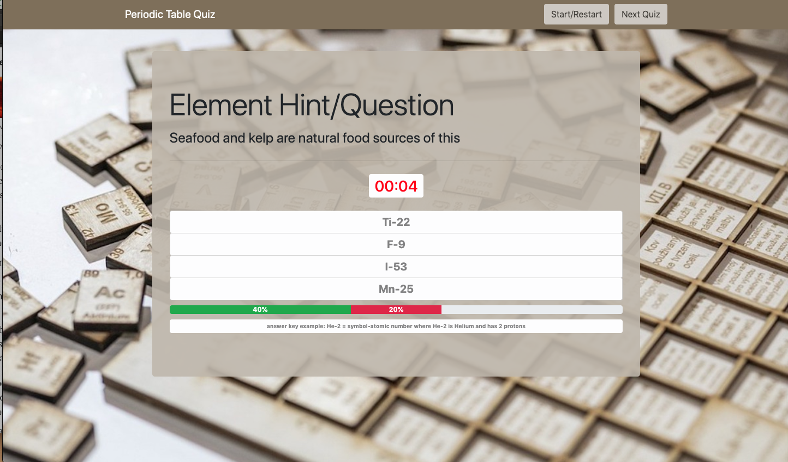

# Trivia Game

Trivia Game - Periodic Table of Elements

## Description

This is a quiz game (trivia) themed on the Periodic Table of Elements.
The design  is a repsonsive first using HTML, CSS, Bootstrap, javascript and JQuery(for all dynamic page activity).
The player will answer a series of 10 multiple choice questions.  The player is allotted 15 seconds to answer each question.
After answering page will show the results/correct answer and pause for 3 seconds until next question loads.
After 10 questions the player will be shown there results:  correct, incorrect and time-expired and then given chance to play
another set of 10 questions.  There will also be a progress bar visible during play showing correct and incorrect bars.
Once all sets of questions have been used the player will have an option to restart the whole series of questions sets again.

## Getting Started

### Dependencies

* none - responsive design usable on phone, table, laptop or desktop

### Installing

* none necessary - use browser to play

### Executing program

* open in browser and follow instructions
*   1. click on unordered list of possible answers for each question
    2. play another set of 10 questions after completing one
    3. option to re-play all sets of questions after they have been completed
    

## Help

For further development details see [UseCases and Psuedo Code](UseCases-PsuedoCode.md)

## Authors

Myles Carey 
mylescarey2019@gmail.com 

## Version History
 
* 0.1
    * Initial Release

## License

## Acknowledgments

Thanks to beta testers - my 15yo & 17yo daughters and wife 
